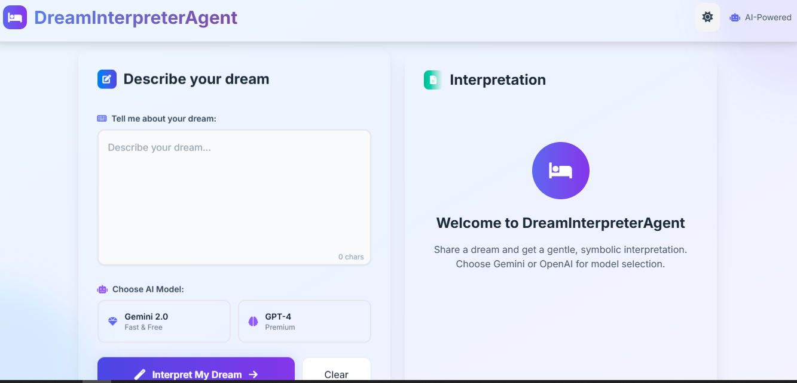

# 🛌 DreamInterpreterAgent - Day 85 of #100DaysOfAI-Agents

<div align="center">


**Your empathetic assistant for symbolic dream interpretation**

[🚀 Quick Start](#-quick-start) • [✨ Features](#-features) • [🖼 Preview](#-preview) • [🏗️ Project Architecture](#-project-architecture) • [⚙️ Configuration](#-configuration--setup) • [🧪 Testing](#-testing--quality-assurance)

</div>

---

## ✨ What is DreamInterpreterAgent?

DreamInterpreterAgent is an AI-powered assistant that accepts a user's dream description and returns a thoughtful, symbolic interpretation in a supportive, gentle tone. It integrates with Google Gemini by default, and optionally OpenAI GPT-4 if configured. If no LLM keys are available, the agent falls back to a local heuristic interpreter that extracts common symbols and emotions and composes a comforting insight.

### 🌟 Key Highlights

- **🔎 Symbolic Analysis**: Extracts symbols (e.g., flying, falling, water) and suggests meanings.
- **💬 Supportive Tone**: Interpretations are creative, grounded, and non-judgmental.
- **🔁 LLM Flexibility**: Gemini default with optional OpenAI GPT fallback.
- **🎨 Polished UI**: Modern two-column Tailwind dashboard with dark/light mode and handy actions (copy/download/print).

## 🎯 Features

### 🚀 Core Functionality
- ✅ Interpret free-text dream descriptions
- ✅ Identify key symbols and short meanings
- ✅ Provide a short positive takeaway or insight
- ✅ Allow model selection: Gemini or OpenAI

### 🧭 User Experience
- ✅ Clean, responsive UI with a two-column layout
- ✅ Theme toggle (dark/light) and animated background
- ✅ Copy, download, and print actions for outputs

### 🛠️ Developer-Friendly
- ✅ `LLMService` wrapper for model abstraction
- ✅ Safe fallbacks and robust parsing
- ✅ Easy to run locally (no API keys required for local heuristics)

## 🚀 Quick Start

### 📋 Prerequisites

- Python 3.8+
- (Optional) Google Gemini API Key and/or OpenAI API Key for LLM output

### 🔧 Manual Installation (Windows)

```powershell
# 1. Open a terminal and navigate to the agent folder
cd D:\100DaysOfAI-Agents\85_DreamInterpreterAgent

# 2. Create and activate a virtual environment
python -m venv venv
venv\Scripts\activate

# 3. Install dependencies
pip install -r requirements.txt

# 4. (Optional) Create a .env file with API keys
# Example .env:
# GEMINI_API_KEY=AIza... 
# OPENAI_API_KEY=sk-...
# DEFAULT_LLM=gemini

# 5. Run the app in dev mode
python main.py

# 6. Open the UI
# http://localhost:9000
```

> Tip: Use `uvicorn web_app:app --reload --port 9000` if you prefer running uvicorn directly.

## 🖼 Preview

Here is a preview of the running UI. Place the screenshot file at `static/demo_screenshot.png` to display it here.



## 🏗️ Project Architecture

```
85_DreamInterpreterAgent/
├── main.py                 # Uvicorn runner
├── web_app.py              # FastAPI web app and routes
├── config.py               # Environment handling and defaults
├── agent.py                # DreamInterpreterAgent core logic
├── requirements.txt        # Python dependencies
├── README.md               # This documentation
├── templates/              # Jinja2 templates
│   └── index.html          # Main UI
├── static/                 # Static assets (CSS, images)
│   └── main.css
│   └── demo_screenshot.png # Optional preview image
├── utils/
│   └── llm_service.py      # LLM wrapper abstraction
└── prompts/
		└── interpreter_prompt.txt
```

### 🔧 Technical Stack

| Component | Technology |
|-----------|------------|
| Backend | Python 3.8+ |
| Web Framework | FastAPI |
| Templates | Jinja2 |
| LLMs | Google Gemini, OpenAI (optional) |
| Frontend | Tailwind CSS + Vanilla JS |

### 🎯 Key Components

- `DreamInterpreterAgent` (`agent.py`): Orchestrates prompt creation, chooses LLM or fallback, and formats the final interpretation.
- `LLMService` (`utils/llm_service.py`): Abstracts Gemini/OpenAI clients, attempts safe JSON parsing, and returns structured outputs.
- `web_app.py`: FastAPI routes for UI and a JSON API (`/api/interpret`).

## ⚙️ Configuration & Setup

Create a `.env` file in the project root (do NOT commit this file):

```
GEMINI_API_KEY=your_gemini_api_key_here
OPENAI_API_KEY=your_openai_api_key_here
DEFAULT_LLM=gemini
UPLOAD_DIR=./uploads
```

The `config.py` strips accidental surrounding quotes from env values for convenience.

## 🧪 Testing & Quality Assurance

### Manual Checks
- Import and run the local interpreter:
	```python
	from agent import DreamInterpreterAgent
	a = DreamInterpreterAgent()
	print(a._local_interpret("I was flying then falling"))
	```

### Automated Tests
- None included by default. I can add a small pytest suite covering the local interpreter and `/api/interpret` if you'd like.

## 🔮 Roadmap

- Persist dream history and allow users to revisit past interpretations
- Add user accounts and export/import features
- Improve LLM prompt engineering and add batch processing
- Add unit and integration tests

## 🤝 Contributing

Contributions are welcome! Please follow the standard flow:

1. Fork the repository
2. Create a feature branch: `git checkout -b feat/your-feature`
3. Make your changes and add tests
4. Run tests and ensure everything passes
5. Open a pull request describing your changes

## 📜 License

This project is part of the **#100DaysOfAI-Agents** challenge by **Muhammad Sami Asghar Mughal**.

**MIT License** - Feel free to use, modify, and distribute the code for personal and commercial purposes.

### 🙏 Acknowledgments

-   **Google Gemini API** for powerful AI capabilities.
-   **OpenAI API** for advanced language models.
-   **FastAPI** for the high-performance web framework.
-   **Tailwind CSS** and **Font Awesome** for UI components and icons.
-   **`aiofiles` and `PyPDF2`** for robust file handling.
-   **The Python community** for a rich ecosystem of libraries.
-   **All contributors** who help improve this project.

---

<div align="center">

## 🎉 Ready to Summarize Your Next Chapter?

**Get concise, AI-powered summaries of your book chapters with ease!**

[🚀 Quick Start](#-quick-start) • [✨ Features](#-features) • [🎭 Examples](#-examples) • [🏗️ Project Architecture](#-project-architecture)

---

**Made with ❤️ by Muhammad Sami Asghar Mughal for Day 85 of #100DaysOfAI-Agents**

</div>


