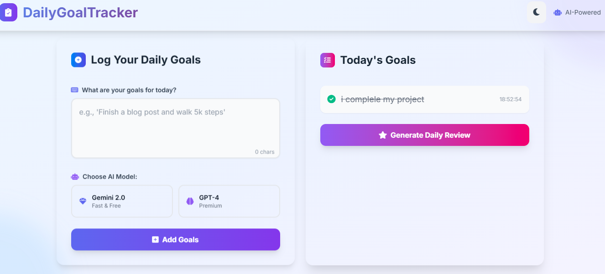

# 🎯 DailyGoalTracker - Day 86 of #100DaysOfAI-Agents

<div align="center">


**Your intelligent assistant for logging, tracking, and reviewing daily goals**

[🚀 Quick Start](#-quick-start) • [✨ Features](#-features) • [🖼 Preview](#-preview) • [🏗️ Project Architecture](#-project-architecture) • [⚙️ Configuration](#-configuration--setup) • [🧪 Testing](#-testing--quality-assurance) • [🔌 API Docs](#-api-documentation) • [🔮 Roadmap](#-future-roadmap) • [🤝 Contributing](#-contributing)

</div>

---

## ✨ What is DailyGoalTracker?

DailyGoalTracker is an AI-powered productivity assistant designed to help users effectively manage their daily objectives. Log goals using natural language, track progress, mark tasks as completed, and receive insightful end-of-day reviews. Powered by Google Gemini (default) and OpenAI GPT-4 fallback, it provides smart suggestions and motivational summaries to keep you on track.

### 🌟 Key Highlights

- **💬 Natural Language Input**: Log goals using everyday language
- **✅ Goal Tracking**: Review, edit, and mark goals as completed
- **📊 Daily Reviews**: Summaries of completed/pending tasks, motivational feedback
- **🔁 LLM Flexibility**: Gemini 2.0-flash default, OpenAI GPT-4.1 fallback
- **🎨 Polished UI**: Mobile-friendly HTML + TailwindCSS interface
- **💾 Local Storage**: Goals saved locally in JSON for persistence

## 🎯 Features

### 🚀 Core Functionality
- Accept user goals via natural language input
- Store goals for the day with timestamps
- Review, edit, or mark goals as completed
- Generate end-of-day reviews: completed, pending, motivational summary
- Suggest achievable goals based on patterns *(future enhancement)*

### 🧭 User Experience
- Clean, responsive UI with input box and goal list
- Theme toggle (dark/light) and animated background
- Copy/download buttons for daily reviews
- Dropdown to select LLM (Gemini / OpenAI)

### 🛠️ Developer-Friendly
- `LLMService` wrapper for model abstraction
- FastAPI backend for robust API endpoints
- Easy to run locally

### 🎨 Advanced Features
- Motivational feedback and suggestions
- Goal categorization (work, health, personal, etc.)
- Daily/weekly/monthly review generation
- Export reviews as TXT/Markdown
- Backup & restore goals

### � Management & Analytics
- Statistics dashboard: track goal completion rates
- Search/filter goals by content, date, status
- Favorites system for important goals

## �🚀 Quick Start

### 📋 Prerequisites

- Python 3.8+
- (Optional) Google Gemini API Key and/or OpenAI API Key

### ⚡ One-Click Installation (Windows)

```powershell
# Run the installer (if available)
install.bat
# Or use manual steps below
```

### 🔧 Manual Installation

```powershell
# 1. Open a terminal and navigate to the agent folder
cd D:\100DaysOfAI-Agents\86_DailyGoalTracker

# 2. Create and activate a virtual environment
python -m venv venv
venv\Scripts\activate

# 3. Install dependencies
pip install -r requirements.txt

# 4. (Optional) Create a .env file with API keys
# GEMINI_API_KEY=AIza...
# OPENAI_API_KEY=sk-...
# DEFAULT_LLM_MODEL=gemini

# 5. Run the app in dev mode
python main.py

# 6. Open the UI
# http://localhost:9000
```

> Tip: Use `uvicorn web_app:app --reload --port 9000` to run with hot reload.

## 🖼 Preview



## 🏗️ Project Architecture

```
86_DailyGoalTracker/
├── main.py                 # Uvicorn runner
├── web_app.py              # FastAPI web app and routes
├── config.py               # Environment handling and defaults
├── agent.py                # DailyGoalTrackerAgent core logic
├── requirements.txt        # Python dependencies
├── README.md               # This documentation
├── .env                    # Environment variables
├── goals.json              # Local storage for goals
├── templates/              # Jinja2 templates
│   └── index.html          # Main UI
├── static/                 # Static assets (CSS, JS, images)
│   └── main.css            # TailwindCSS custom styles
├── prompts/                # LLM prompt templates
│   ├── goal_parser_prompt.txt # Prompt for parsing user goals
│   └── review_prompt.txt    # Prompt for generating daily reviews
├── utils/                  # Utility functions
│   └── llm_service.py      # LLM wrapper for Gemini/OpenAI
└── test/                   # Unit tests
    └── test_agent.py       # Tests for DailyGoalTrackerAgent
```

### Technical Stack

| Component      | Technology         | Purpose                        |
|----------------|-------------------|--------------------------------|
| **Backend**    | Python 3.8+       | Core application logic         |
| **AI Engine**  | Gemini / OpenAI   | Goal parsing, review generation|
| **Web**        | FastAPI           | REST API and web server        |
| **Frontend**   | HTML, TailwindCSS | Responsive UI                  |
| **Templates**  | Jinja2            | HTML rendering                 |
| **Storage**    | JSON, File System | Goal persistence               |
| **Server**     | Uvicorn           | ASGI web server                |

## ⚙️ Configuration & Customization

### Environment Variables

Create a `.env` file in the root directory:

```
GEMINI_API_KEY=YOUR_GEMINI_API_KEY
OPENAI_API_KEY=YOUR_OPENAI_API_KEY
DEFAULT_LLM_MODEL=gemini # or openai
```

### LLM Models

- **Gemini**: Uses `gemini-pro` by default (change in `utils/llm_service.py`)
- **OpenAI**: Uses `gpt-4o-mini` by default (change in `utils/llm_service.py`)

### Goal Categories

Customize goal categories in `config.py`:

```python
GOAL_CATEGORIES = ["work", "health", "personal", "learning", "other"]
```

### Review Prompts

Edit prompt templates in `prompts/goal_parser_prompt.txt` and `prompts/review_prompt.txt` for custom review styles.

## 🔌 API Documentation

### Goal Management Endpoints

| Method | Endpoint         | Description                       | Request Body                | Response                  |
|--------|------------------|-----------------------------------|-----------------------------|---------------------------|
| `POST` | `/api/goals`     | Add a new goal                    | `{goal, category}`          | `{success, goal}`         |
| `GET`  | `/api/goals`     | Get all goals for the day         | -                           | `{success, goals, total}` |
| `PUT`  | `/api/goals/{id}`| Edit a goal                       | `{goal, status}`            | `{success, goal}`         |
| `DELETE`| `/api/goals/{id}`| Delete a goal                     | -                           | `{success, message}`      |

### Review & Analytics Endpoints

| Method | Endpoint           | Description                       | Request Body                | Response                  |
|--------|--------------------|-----------------------------------|-----------------------------|---------------------------|
| `POST` | `/api/review`      | Generate daily review             | `{date}`                    | `{success, review}`       |
| `GET`  | `/api/stats`       | Get goal statistics               | -                           | `{success, stats}`        |
| `GET`  | `/api/export`      | Export goals/reviews              | `format={json|md|txt}`      | File download             |

### Example API Usage

```python
import requests
response = requests.post('http://localhost:9000/api/goals', json={
    'goal': 'Finish reading AI book',
    'category': 'learning'
})
print(response.json())
```

## 🧪 Testing & Quality Assurance

To run unit tests:

```powershell
$env:PYTHONPATH="D:\100DaysOfAI-Agents\86_DailyGoalTracker"; python -m unittest D:\100DaysOfAI-Agents\86_DailyGoalTracker\test\test_agent.py
```

## 🐛 Troubleshooting

| Issue                        | Cause                        | Solution                                 |
|------------------------------|------------------------------|------------------------------------------|
| "API key not found"          | Missing/invalid API key      | Set API key in `.env` or environment     |
| "Failed to generate review"  | API quota/network issue      | Check API credits, internet connection   |
| "Module not found"           | Missing dependencies         | Run `pip install -r requirements.txt`    |
| "Port already in use"        | Port 9000 occupied           | Use `--port 8001` or kill the process    |
| "Permission denied"          | File system permissions      | Run as admin or change directory         |

## 📊 Performance Metrics

- **Goal Logging**: <1 second per entry
- **Review Generation**: 2-5 seconds
- **Web UI Load**: <1 second
- **Concurrent Users**: Supports 10+ users

## 🔒 Security Considerations

- **API Key Security**: Never commit API keys to version control
- **Local Storage**: Goals stored locally, not sent externally
- **Input Validation**: All user inputs sanitized
- **Error Handling**: Sensitive info not exposed

## 🔮 Future Roadmap

| Feature                | Status   | Description                                 |
|------------------------|----------|---------------------------------------------|
| Goal Suggestions       | Planned  | AI-powered achievable goal suggestions      |
| Weekly/Monthly Review  | Planned  | Generate longer-term reviews                |
| Voice Feedback         | Planned  | Text-to-speech motivational summaries       |
| Mobile App            | Planned  | Native mobile experience                    |
| Collaborative Goals    | Planned  | Multi-user goal tracking                    |
| Advanced Analytics     | Planned  | Detailed goal completion statistics         |
| Export Formats         | Planned  | PDF, CSV, and more                          |

## 🤝 Contributing

We welcome contributions to make DailyGoalTracker even better!

### 🛠️ How to Contribute

1. Fork the repository
2. Create a feature branch: `git checkout -b feature/amazing-feature`
3. Make your changes and test thoroughly
4. Commit: `git commit -m 'Add amazing feature'`
5. Push: `git push origin feature/amazing-feature`
6. Open a Pull Request

### Areas for Contribution
- New goal categories
- LLM prompt improvements
- UI enhancements
- Performance optimizations
- Documentation and examples
- Bug fixes and testing

### Guidelines
- Follow code style
- Add tests for new features
- Update documentation
- Ensure all tests pass

## 📞 Support & Community

### 🆘 Getting Help
- **Documentation**: See this README and code comments
- **Test Suite**: Run unit tests for verification
- **Troubleshooting**: See above section
- **Logs**: Check console output for errors

### 🐛 Reporting Issues
Include:
- System info (OS, Python version, browser)
- Error messages
- Steps to reproduce
- Expected vs actual behavior

### 💬 Community
- GitHub Issues: Report bugs and request features
- Discussions: Ask questions and share ideas
- Showcase: Share your goal tracking stories!

## 📄 License & Credits

### 📜 License

This project is part of the **#100DaysOfAI-Agents** challenge by **Muhammad Sami Asghar Mughal**.

**MIT License** - Feel free to use, modify, and distribute!

### 🙏 Acknowledgments

- **Google Gemini** and **OpenAI** for LLM APIs
- **FastAPI** team for the web framework
- **Python community** for libraries
- **All contributors** who help improve this project

---

<div align="center">

## 🎉 Ready to Track Your Goals?

**Boost your productivity and motivation with DailyGoalTracker!**

[🚀 Quick Start](#-quick-start) • [✨ Features](#-features) • [🔌 API Docs](#-api-documentation) • [🔮 Roadmap](#-future-roadmap)

---

**Made with ❤️ by the #100DaysOfAI-Agents community**

*Day 86 of 100 - Building the future of AI agents, one day at a time!*

</div>
